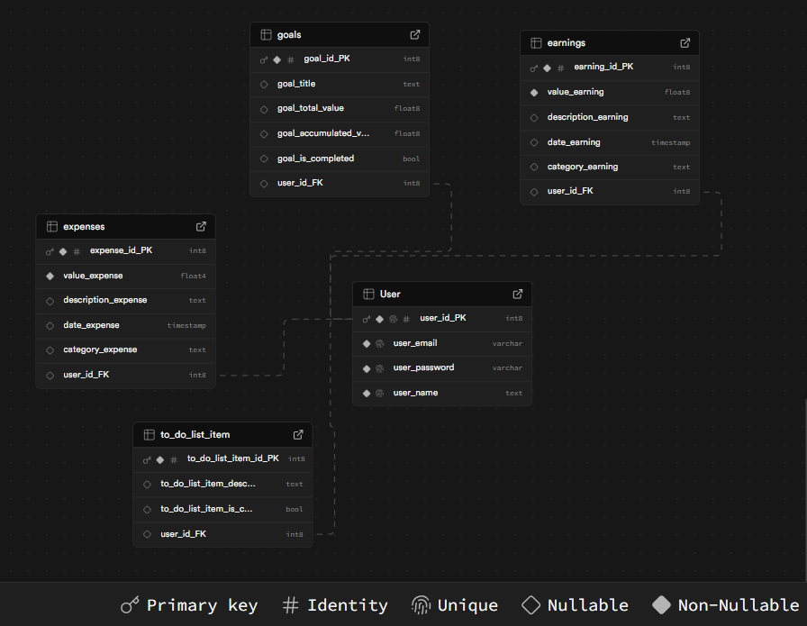
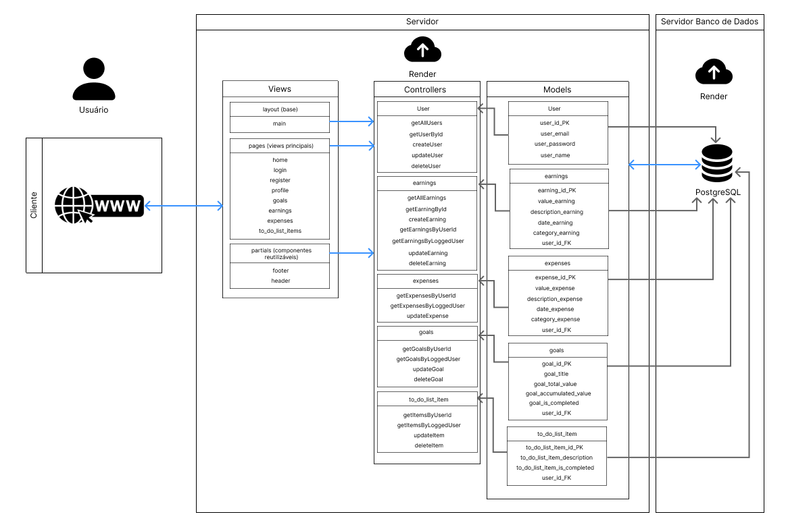
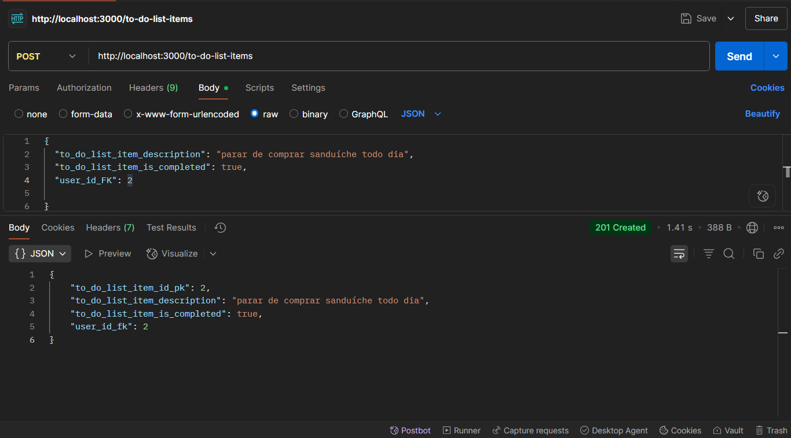
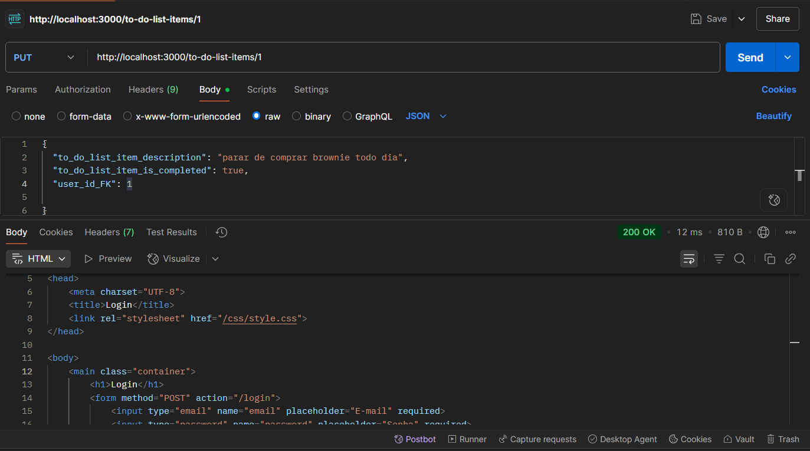

# Web Application Document - Projeto Individual - Módulo 2 - Inteli

<!-- **_Os trechos em itálico servem apenas como guia para o preenchimento da seção. Por esse motivo, não devem fazer parte da documentação final._** -->

## Projeto Fin.uni

<!-- Pensar no nome do projeto -->

#### Por Anne Esther Lins Figueirôa
- LinkedIn: <https://www.linkedin.com/in/anneestherlf/>
- GitHub: <https://github.com/anneestherlf>
<!-- Lembrar de colocar meu nome, linkedin e github aqui  -->

## Sumário

1. [Introdução](#c1)  
2. [Visão Geral da Aplicação Web](#c2)  
3. [Projeto Técnico da Aplicação Web](#c3)  
4. [Desenvolvimento da Aplicação Web](#c4)  
5. [Referências](#c5)  

<br>

## <a name="c1"></a>1. Introdução (Semana 01)
<!-- 
*Preencha com até 300 palavras – sem necessidade de fonte.*
*Descreva brevemente o sistema que você irá desenvolver.* -->
A opção escolhida para o desenvolvimento do presente projeto foi um **gerenciador de tarefas para organização e produtividade**. Com a finalidade de explorar um nicho específico, o tema do projeto será voltado para gestão financeira, destinado especialmente a jovens universitários com dificuldades em controlar seus gastos e que estão pouco familiarizados com termos econômicos complexos.

A necessidade de educação financeira é evidente na população brasileira: 90% admitem precisar de recursos sobre o tema, e 76% afirmam ter metas de planejamento financeiro, segundo a pesquisa Fenaprevi [1]. Entre universitários, existe uma necessidade ainda mais intensa. Um estudo da ANBIMA (2022) revela que apenas 34% dos jovens entre 18 e 24 anos conseguem poupar parte da renda, enquanto 68% não acompanham seus gastos mensais [2]. Além disso, dados do Instituto Brasileiro de Economia (FGV/IBRE) mostram que 61% dos universitários não possuem reserva de emergência, e 47% já se endividaram por falta de planejamento [3].

Diante desses desafios, o objetivo principal é oferecer uma solução simples e intuitiva, que permita gerenciar finanças sem exigir conhecimentos técnicos ou tempo excessivo. Diferentemente das ferramentas atuais – que demandam expertise financeira ou cerca de 20 minutos diários para preenchimento de planilhas –, a proposta é revolucionar a experiência do usuário. Com apenas 5 minutos por dia para registrar compras em um formulário simplificado, o usuário terá acesso a gráficos claros de sua situação financeira, metas de economia e um planner para sonhos de consumo (gerenciador de tarefas).

Ao combinar usabilidade intuitiva com funcionalidades estratégicas, a solução busca empoderar financeiramente jovens universitários, promovendo organização financeira de qualidade independentemente de sua bagagem técnica. Assim, o projeto transforma o controle orçamentário em um hábito acessível e, principalmente, sustentável a longo prazo.


## <a name="c2"></a>2. Visão Geral da Aplicação Web

### 2.1. Personas (Semana 01)

Para garantir que o produto atenda às reais necessidades do público-alvo, foram desenvolvidas proto-personas [4]  baseadas em observações do cotidiano e vivências da autora. Embora não originadas de pesquisas formais (qualitativas/quantitativas), essas personas representam perfis reais identificados no contexto universitário, permitindo a criação de features mais assertivas.

<div align="center">
  <sub>Júlia Oliveira - Proto Persona</sub><br>
  <br>
  <sup>Fonte: a autora.</sup>
</div>

<div align="center">
  <sub>Lucas Souza - Proto Persona</sub><br>
  <br>
  <sup>Fonte: a autora.</sup>
</div>

Essas personas guiarão o desenvolvimento das funcionalidades, mas poderão ser refinadas ao longo do projeto conforme novas descobertas ou validações com usuários reais.

<!-- *Posicione aqui sua(s) Persona(s) em forma de texto markdown com imagens, ou como imagem de template preenchido. Atualize esta seção ao longo do módulo se necessário.* -->

### 2.2. User Stories (Semana 01)

As User Stories abaixo foram cuidadosamente elaboradas para guiar o desenvolvimento do projeto, seguindo os critérios INVEST (Independent, Negotiable, Valuable, Estimable, Small, Testable) [5].

Identificação | US01
--- | ---
Persona | Lucas Souza
User Story | Como estudante universitário que recebe bolsas acadêmicas, quero um ambiente para inserir todo o valor da minha renda, para que eu possa enxergar visualmente como vou dividir meus gastos de forma a não gerar futuras dívidas.
Critério de aceite 1 | CR1: Campo de inserção de renda. Deve existir um campo claro para inserção do valor total da renda mensal. O campo deve aceitar apenas valores numéricos (com validação para números negativos). Essas informações devem ser guardadas em uma conta do usuário que será criada no cadastro e constantemente acessada pelo login.
Critério de aceite 2 | CR2: Visualização da distribuição de gastos. O sistema deve exibir um gráfico simples (ex.: pizza ou barras) com a proporção entre renda e gastos totais. Deve permitir visualização por categorias pré-definidas (alimentação, transporte, lazer etc.). O gráfico deve atualizar automaticamente após nova inserção de renda.
Critérios INVEST | Esta User Story atende plenamente aos critérios INVEST por ser Independente (não requer outras funcionalidades para ter valor), Negociável (os detalhes da visualização podem ser refinados com feedback), e Valorosa (resolve diretamente o problema de planejamento financeiro do Lucas). Além disso, é Estimável (o escopo é delimitado e mensurável), Pequena (foca em uma única capacidade essencial) e Testável (com critérios de aceite claros e verificáveis). Essa combinação garante que a US01 seja viável, relevante e eficaz para o desenvolvimento incremental do produto. 

Identificação | US02
--- | ---
Persona | Júlia Oliveira
User Story | Como estudante com renda limitada que deseja realizar o sonho de comprar uma viagem para a Europa, quero acesso a gráficos e funcionalidades de organização de tarefas para definir ações organizadas e atingir meu objetivo financeiro.
Critério de aceite 1 | CR1: Definição de Meta Financeira. Sistema deve permitir cadastrar o valor total da viagem/meta, a quantidade do valor que já está guardado e quanto falta.
Critério de aceite 2 | CR2: Gráficos de Progresso. Deve exibir gráfico de evolução mensal da economia (tipo linha ou barra). Gráfico deve comparar meta X valor acumulado. 
| Critério de aceite 3 | CR3: Planner de Ações. Deve oferecer lista de tarefas vinculadas à meta (ex: "reduzir gastos com delivery"). Deve permitir marcar tarefas como concluídas. |

Identificação | US03
--- | ---
Persona | Júlia Oliveira
User Story | Como uma aluna universitária (com tempo e rotina limitados) que não entende temas complexos de finanças e não consegue ser constante no uso de plataformas padrões de gestão financeira, quero uma ferramenta não-técnica de planejamento financeiro, para que eu possa usufruir de suas funcionalidades sem ter a necessidade de estudar profundamente sobre finanças por fora.
Critério de aceite 1 | CR1: Interface Simplificada. O sistema deve ter um painel principal com no máximo 5 ações primárias visíveis. Todos os termos técnicos devem ser substituídos por palavras da linguagem cotidiana (ex: "Saldo = quanto você tem disponível agora"). Deve usar ícones intuitivos e cores categorizadas (ex: verde para entradas, vermelho para gastos).


Identificação | US04
--- | ---
Persona | Lucas Souza
User Story | Como um jovem que gasta compulsivamente com jogos assim que recebe dinheiro, quero entender quanto da minha renda posso direcionar para cada área da minha vida, para garantir que não ficarei sem dinheiro para necessidades básicas no final do mês.
Critério de aceite 1 | CR1: Divisão de Renda. O sistema deve mostrar em um gráfico a distribuição percentual dos seus gastos (ex: 50% necessidades, 30% lazer, 20% poupança) de forma a apresentar se a divisão de gastos está eficiente ou não (ex: 70% entretenimento seria um alerta).


<!-- *Posicione aqui a lista de User Stories levantadas para o projeto. Siga o template de User Stories e utilize a referência USXX para numeração (US01, US02, US03, ...). Indique todas as User Stories mapeadas, mesmo aquelas que não forem implementadas ao longo do projeto. Não se esqueça de explicar o INVEST de 1 User Storie prioritária.* -->

Essa abordagem assegura que todas as features desenvolvidas entreguem valor real aos usuários finais, mantendo o foco na usabilidade e na solução dos problemas-chave identificados.

---

## <a name="c3"></a>3. Projeto da Aplicação Web

### 3.1. Modelagem do banco de dados  (Semana 3)

<!-- *Posicione aqui os diagramas de modelos relacionais do seu banco de dados, apresentando todos os esquemas de tabelas e suas relações. Utilize texto para complementar suas explicações, se necessário.*

*Posicione também o modelo físico com o Schema do BD (arquivo .sql)* -->

#### 3.1.1. Modelo Relacional

A priori, o modelo conceitual foi desenvolvido para gerar a organização das ideias das principais entidades do sistema de gestão financeira e seus relacionamentos. As entidades identificadas são:

- **User**: Armazena os dados dos usuários do sistema (cadastro e autenticação);
- **Expenses**: Registra todas as despesas dos usuários com categorização;
- **Earnings**: Armazena os ganhos e rendimentos dos usuários;
- **Goals**: Gerencia as metas financeiras estabelecidas pelos usuários;
- **To_do_list_item**: Controla as tarefas relacionadas ao planejamento financeiro.

O diagrama relacional abaixo ilustra a estrutura completa do banco de dados, mostrando tabelas, atributos, tipos de dados, chaves primárias (PK), chaves estrangeiras (FK) e os relacionamentos entre as entidades:

<div align="center">
  <sub>Diagrama Relacional do Banco de Dados</sub><br>
  <br>
  <sup>Fonte: a autora.</sup>
</div>

Principais relacionamentos:
- **1:N** entre User e Expenses (um usuário pode ter várias despesas);
- **1:N** entre User e Earnings (um usuário pode ter múltiplos ganhos);
- **1:N** entre User e Goals (um usuário pode definir várias metas);
- **1:N** entre User e To_do_list_item (um usuário pode criar múltiplas tarefas).

#### 3.1.2. Modelo Físico (SQL Schema)

O modelo físico consiste no script SQL que implementa a estrutura do banco de dados relacional, definindo as tabelas, colunas, tipos de dados, restrições de integridade, chaves primárias e estrangeiras.

O arquivo contendo o script SQL está disponível no repositório do projeto, no caminho: 
``projeto-individual-M2-inteli\scripts\init.sql``.

```sql
-- Tabela de usuários
CREATE TABLE User (
  user_id_PK SERIAL PRIMARY KEY,
  user_email VARCHAR(100) UNIQUE NOT NULL,
  user_password VARCHAR(100) NOT NULL,
  user_name TEXT NOT NULL
);

-- Tabela de ganhos
CREATE TABLE earnings (
  earning_id_PK SERIAL PRIMARY KEY,
  value_earning FLOAT NOT NULL,
  description_earning TEXT,
  date_earning TIMESTAMP NOT NULL,
  category_earning TEXT,
  user_id_FK INT NOT NULL,
  CONSTRAINT fk_earnings_user FOREIGN KEY (user_id_FK) REFERENCES "User"(user_id_PK)
);

-- Tabela de metas
CREATE TABLE goals (
  goal_id_PK SERIAL PRIMARY KEY,
  goal_title TEXT NOT NULL,
  goal_total_value FLOAT NOT NULL,
  goal_accumulated_value FLOAT DEFAULT 0,
  goal_is_completed BOOLEAN DEFAULT FALSE,
  user_id_FK INT NOT NULL,
  CONSTRAINT fk_goals_user FOREIGN KEY (user_id_FK) REFERENCES "User"(user_id_PK)
);

-- Tabela de despesas
CREATE TABLE expenses (
  expense_id_PK SERIAL PRIMARY KEY,
  value_expense FLOAT NOT NULL,
  description_expense TEXT,
  date_expense TIMESTAMP NOT NULL,
  category_expense TEXT,
  user_id_FK INT NOT NULL,
  CONSTRAINT fk_expenses_user FOREIGN KEY (user_id_FK) REFERENCES "User"(user_id_PK)
);

-- Tabela de itens da lista de tarefas
CREATE TABLE to_do_list_item (
  to_do_list_item_id_PK SERIAL PRIMARY KEY,
  to_do_list_item_description TEXT NOT NULL,
  to_do_list_item_is_completed BOOLEAN DEFAULT FALSE,
  user_id_FK INT NOT NULL,
  CONSTRAINT fk_todolist_user FOREIGN KEY (user_id_FK) REFERENCES "User"(user_id_PK)
);
```

Este script pode ser utilizado para criar a estrutura completa do banco de dados em um sistema gerenciador de banco de dados relacional (SGBD), como o próprio PostgreSQL.


### 3.1.1 BD e Models (Semana 5)
<!-- *Descreva aqui os Models implementados no sistema web* -->

O sistema utiliza o banco de dados PostgreSQL para armazenar todas as informações essenciais, como usuários, ganhos, despesas, metas e tarefas. A estrutura do banco é definida por meio de scripts SQL localizados na pasta `scripts`, especialmente o arquivo `init.sql`, que contém os comandos para criação das tabelas. 

Os Models do projeto, localizados na pasta `models`, são responsáveis por representar e manipular cada uma dessas tabelas no código. O `userModel.js` gerencia os dados dos usuários, incluindo autenticação e cadastro. O `earningsModel.js` lida com os registros de ganhos financeiros, enquanto o `expensesModel.js` trata das despesas cadastradas pelos usuários. O `goalsModel.js` representa as metas financeiras, permitindo o acompanhamento do progresso individual, e o `to_do_list_itemModel.js` gerencia as tarefas da lista pessoal do usuário. 

Cada model encapsula as operações de acesso ao banco, como inserção, consulta, atualização e remoção de dados, garantindo uma separação clara entre a lógica de negócio e a persistência dos dados. 

Para configurar o banco de dados, basta editar o arquivo `.env` com a string de conexão adequada e executar o script `init.sql` no seu PostgreSQL local ou no painel do Supabase, conforme preferir. Um tutorial mais claro pode ser encontrado na seção "Como Executar o Projeto Localmente" no `README.md` do projeto (capa do repositório).


### 3.2. Arquitetura (Semana 5)

Abaixo, você encontrará uma ilustração dos processos que acontecem por trás da plataforma, mostrando de forma visual como os dados circulam entre o usuário, as camadas do servidor (Views, Controllers e Models) e o banco de dados.

<div align="center">
  <sub>Diagrama de Arquitetura da Aplicação Web</sub><br>
  <br>
  <sup>Fonte: a autora. Link para acesso ao documento com mais detalhes no Figma: <a href="https://www.figma.com/design/BaMMKxsQq8ahLz2iGgysEr/Untitled?node-id=0-1&t=pcLZ0SmZYVguS3b5-1">clique aqui.</a> </sup>
</div>

Tudo começa quando o usuário, utilizando um navegador web, realiza uma ação, como acessar uma página ou enviar um formulário. Essa ação gera uma requisição que é enviada do cliente para o servidor da aplicação. No servidor, a primeira camada a ser acionada é a dos Controllers. Cada controller é responsável por uma área específica do sistema, como usuários, ganhos, despesas, metas ou itens de lista de tarefas, conforme explicitado no diagrama. Por exemplo, ao acessar a página de perfil, o controller de usuários (User) é acionado e executa métodos como getUserById para buscar as informações do usuário requisitado.

O controller, ao receber a solicitação, precisa acessar ou manipular dados. Para isso, ele se comunica com o Model correspondente. Os Models, detalhados no diagrama para cada entidade do sistema, encapsulam toda a lógica de acesso ao banco de dados. Eles recebem comandos dos controllers, realizam consultas ou alterações no banco PostgreSQL, e retornam os resultados para o controller. Por exemplo, o Model de usuários executa a busca pelo ID solicitado e devolve ao controller um objeto com os dados do usuário, incluindo campos como email, nome e senha (quando necessário).

De posse dos dados retornados pelo Model, o controller então escolhe qual View será renderizada e transmite essas informações para ela. As Views, organizadas em layouts, páginas principais e componentes reutilizáveis (no presente projeto), são responsáveis por apresentar os dados de forma visual ao usuário. Por exemplo, ao renderizar a página de perfil, a View profile recebe do controller os dados do usuário e monta a interface que será exibida no navegador. O mesmo processo ocorre para outras áreas do sistema: controllers de ganhos, despesas, metas e tarefas solicitam dados aos seus respectivos models e, após receberem as informações, encaminham-nas para as views apropriadas, como earnings, expenses, goals ou to_do_list_items.

Por fim, a View já montada é enviada de volta ao cliente, fechando o ciclo de comunicação. O usuário vê na tela os dados atualizados, podendo interagir novamente e reiniciar o fluxo. Todo esse processo garante que a lógica de apresentação, a lógica de negócio e o acesso a dados estejam devidamente separados, promovendo organização, segurança e facilidade de manutenção. 

<!-- *Posicione aqui o diagrama de arquitetura da sua solução de aplicação web. Atualize sempre que necessário.*

**Instruções para criação do diagrama de arquitetura**  
- **Model**: A camada que lida com a lógica de negócios e interage com o banco de dados.
- **View**: A camada responsável pela interface de usuário.
- **Controller**: A camada que recebe as requisições, processa as ações e atualiza o modelo e a visualização.
  
*Adicione as setas e explicações sobre como os dados fluem entre o Model, Controller e View.* -->

### 3.3. Wireframes (Semana 03)

<!-- *Posicione aqui as imagens do wireframe construído para sua solução e, opcionalmente, o link para acesso (mantenha o link sempre público para visualização).* -->

Os wireframes apresentados nesta seção representam a estrutura básica e o fluxo de navegação do sistema de gerenciamento financeiro para universitários. Desenvolvidos na fase inicial do projeto, esses esboços visuais buscam traduzir as necessidades das personas em interfaces intuitivas e funcionais, priorizando a simplicidade e usabilidade que são fundamentais para nosso público-alvo.

Abaixo, encontram-se as duas telas principais de uso: o **painel de dados financeiros** e a **tela de tarefas para alcance de metas**.

<div align="center">
  <sub>Painel de dados financeiros - Wireframe</sub><br>
  <br>
  <sup>Fonte: a autora.</sup>
</div>

<div align="center">
  <sub>Tela de controle de metas e tarefas - Wireframe</sub><br>
  <br>
  <sup>Fonte: a autora.</sup>
</div>

O painel principal (US01) foi projetado para auxiliar Lucas na organização de seus gastos, oferecendo uma visualização clara de sua distribuição financeira em relação à renda, além de armazenar automaticamente os dados em sua conta para possibilitar o acesso contínuo e atualizado. Além disso, a tela de tarefas (US02) fornece à Júlia as ferramentas necessárias para estruturar seu planejamento em etapas alcançáveis, direcionando-a de forma prática rumo à sua meta de viagem à Europa.

A linguagem acessível e intuitiva adotada nas interfaces (US03) elimina termos técnicos, facilitando a compreensão por parte de jovens sem familiaridade com finanças. Complementarmente, o gráfico de categorias de gastos (US04) atua como um recurso reflexivo, permitindo que o usuário identifique padrões de consumo e tome decisões mais conscientes sobre suas prioridades financeiras. Essa abordagem integrada assegura que o sistema não apenas apresente dados, mas também promova mudanças de comportamento sustentáveis.

<div align="center">
  <sub>Wireflow</sub><br>
  <br>
  <sup>Fonte: a autora.</sup>
</div>

Além das principais telas, existem: 
- Tela de Login;
- Tela de Cadastro;
- Tela de tutorial de como utilizar o projeto;
- Tela de formulário de primeiro acesso;
- Tela de atualização de dados pessoais e dados financeiros.

Para visualizar o wireflow (user flow) e wireframes das demais telas da aplicação, [clique aqui](https://www.figma.com/design/dkTR4PEGsyifPRIcR5tVbP/Projeto-Individual-Integrado---Wireframes?node-id=0-1&t=ViTLmAcZim5B6GDf-1). 


### 3.4. Guia de estilos (Semana 05)

*Descreva aqui orientações gerais para o leitor sobre como utilizar os componentes do guia de estilos de sua solução.*


### 3.5. Protótipo de alta fidelidade (Semana 05)

*Posicione aqui algumas imagens demonstrativas de seu protótipo de alta fidelidade e o link para acesso ao protótipo completo (mantenha o link sempre público para visualização).*

### 3.6. WebAPI e endpoints (Semana 05)

<!-- *Utilize um link para outra página de documentação contendo a descrição completa de cada endpoint. Ou descreva aqui cada endpoint criado para seu sistema.*   -->

A aplicação expõe uma API RESTful organizada na pasta `routes`, permitindo a integração e o consumo dos dados por meio de endpoints bem definidos. Cada recurso principal do sistema possui seu próprio conjunto de rotas: usuários (`userRoutes.js`), ganhos (`earningsRoutes.js`), despesas (`expensesRoutes.js`), metas (`goalsRoutes.js`) e tarefas (`to_do_list_itemRoutes.js`). Os endpoints seguem o padrão REST, permitindo operações de criação (POST), leitura (GET), atualização (PUT/PATCH) e exclusão (DELETE). 

Por exemplo, para consultar todos os ganhos do usuário autenticado, utiliza-se o endpoint `GET /api/earnings/me`; para adicionar uma nova despesa, utiliza-se `POST /api/expenses`. Todos os endpoints estão documentados no código e podem ser testados facilmente utilizando ferramentas como o arquivo `rest.http` presente na raiz do projeto, o Insomnia ou o Postman. 

Para testar as APIs, basta garantir que o servidor esteja rodando (comando `node server.js` no terminal; mais detalhes podem ser encontrados no arquivo `README.md` na capa do repositório) e enviar requisições HTTP para os endpoints desejados, utilizando o token de autenticação quando necessário. 

As rotas de autenticação e registro de usuário também estão disponíveis, permitindo o fluxo completo de cadastro, login e uso da aplicação. Caso precise rodar as migrações do banco de dados novamente, basta executar o script SQL correspondente, e para configurar o acesso ao banco, ajuste as variáveis de ambiente no arquivo `.env` conforme as instruções do `README.md`.


Uma observação importante é que endpoints protegidos exigem autenticação. Caso tente acessar ou modificar recursos protegidos sem estar autenticado, o middleware de autenticação (`requireLogin`) redirecionará para a tela de login ou retornará uma resposta de erro apropriada, dependendo do tipo de requisição (HTML ou JSON).

Para facilitar testes durante o desenvolvimento, o controller de tarefas (`to_do_list_items`) pode aceitar um user_id_FK diretamente no corpo da requisição caso não haja sessão ativa, permitindo criar itens fictícios sem autenticação. Esse ajuste é recomendado apenas para ambiente de testes e pode ser removido em produção. Exemplo de lógica implementada:

```javascript
// Para testes: usa user_id_FK do body se não houver sessão
const userId = req.session.userId || req.body.user_id_FK;
if (!userId) return res.status(401).json({ error: 'Não autenticado e user_id_FK não fornecido' });
```

<div align="center">
  <sub>Exemplo de teste no Postman de POST bem sucedido. </sub><br>
  <br>
  <sup>Fonte: a autora.</sup>
</div>

<div align="center">
  <sub>Exemplo de teste no Postman no caso de PUT sem autenticação (recebe a página de login).</sub><br>
  <br>
  <sup>Fonte: a autora.</sup>
</div>

Dessa forma, a API garante segurança, flexibilidade e facilidade de uso tanto para usuários finais quanto para desenvolvedores e testadores.


### 3.7 Interface e Navegação (Semana 07)

*Descreva e ilustre aqui o desenvolvimento do frontend do sistema web, explicando brevemente o que foi entregue em termos de código e sistema. Utilize prints de tela para ilustrar.*

---

## <a name="c4"></a>4. Desenvolvimento da Aplicação Web (Semana 8)

### 4.1 Demonstração do Sistema Web (Semana 8)

*VIDEO: Insira o link do vídeo demonstrativo nesta seção*
*Descreva e ilustre aqui o desenvolvimento do sistema web completo, explicando brevemente o que foi entregue em termos de código e sistema. Utilize prints de tela para ilustrar.*

### 4.2 Conclusões e Trabalhos Futuros (Semana 8)

*Indique pontos fortes e pontos a melhorar de maneira geral.*
*Relacione também quaisquer outras ideias que você tenha para melhorias futuras.*


## <a name="c5"></a>5. Referências

<!-- _Incluir as principais referências de seu projeto, para que seu parceiro possa consultar caso ele se interessar em aprofundar. Um exemplo de referência de livro e de site:_<br> -->

[1] Pesquisa Fenaprevi-Datafolha. Disponível em: <https://fenaprevi.org.br/noticias/pesquisa-fenaprevi-datafolha-explora-como-o-brasileiro-se-planeja-e-se-protege-para-o-futuro-e-para-a-aposentadoria>. Acesso em: 28 abr. 2025.

[2] Raio X do Investidor. Disponível em: <https://www.anbima.com.br/pt_br/noticias/raio-x-do-investidor-numero-de-pessoas-que-aplica-em-produtos-financeiros-dispara-na-geracao-z.htm>. Acesso em: 28 abr. 2025.

[3] Maioria dos brasileiros não consegue guardar dinheiro, mostra pesquisa. Disponível em: <https://www.cnnbrasil.com.br/economia/financas/maioria-dos-brasileiros-nao-consegue-guardar-dinheiro-mostra-pesquisa/>. Acesso em: 28 abr. 2025.

[4] Proto-persona: o que é e como criar a sua. Disponível em: <https://www.mergo.com.br/blog/ux-research/proto-persona-o-que-e-e-como-criar-a-sua/>. Acesso em: 28 abr. 2025.

[5] Conheça o INVEST. Disponível em: <https://incuca.net/conheca-o-invest-e-descubra-como-escrever-boas-historias-de-usuarios/>. Acesso em: 28 abr. 2025.


---
